# Omarchy Kings Theme

Kings is a dark court theme built around lacquered brown, old gold, parchment, and a measured spread of jewel-tone accents. It keeps the desktop moody and ceremonial without turning the whole shell into costume drama: warm shadows, gilded highlights, and just enough color separation to keep terminals and UI states legible.

## Preview


## Install

Use the Omarchy theme installer:

```bash
omarchy-theme-install https://github.com/oldjobobo/omarchy-kings-theme
```

## Wallpapers

<table>
  <tr>
    <td>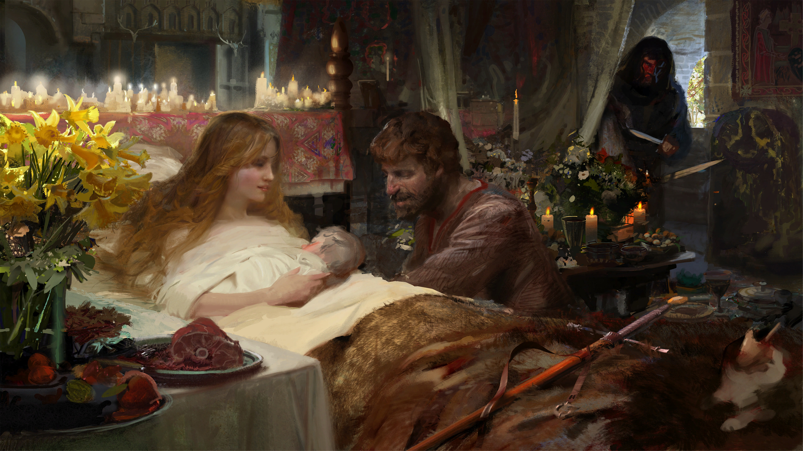</td>
    <td>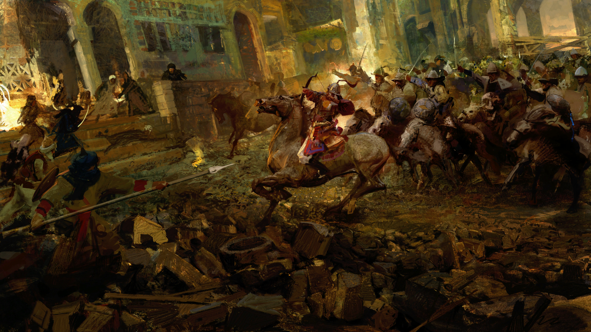</td>
    <td>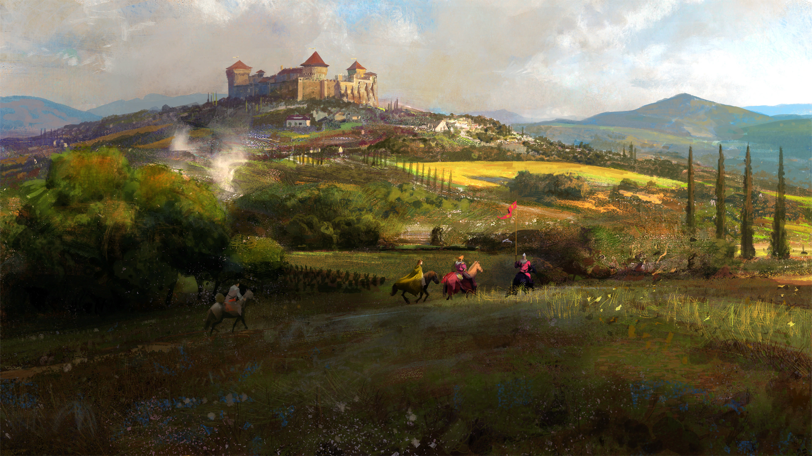</td>
  </tr>
  <tr>
    <td>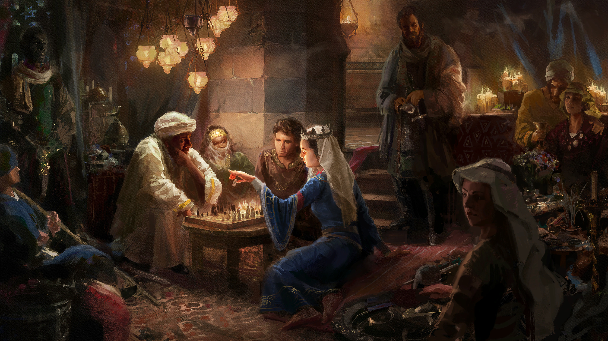</td>
    <td>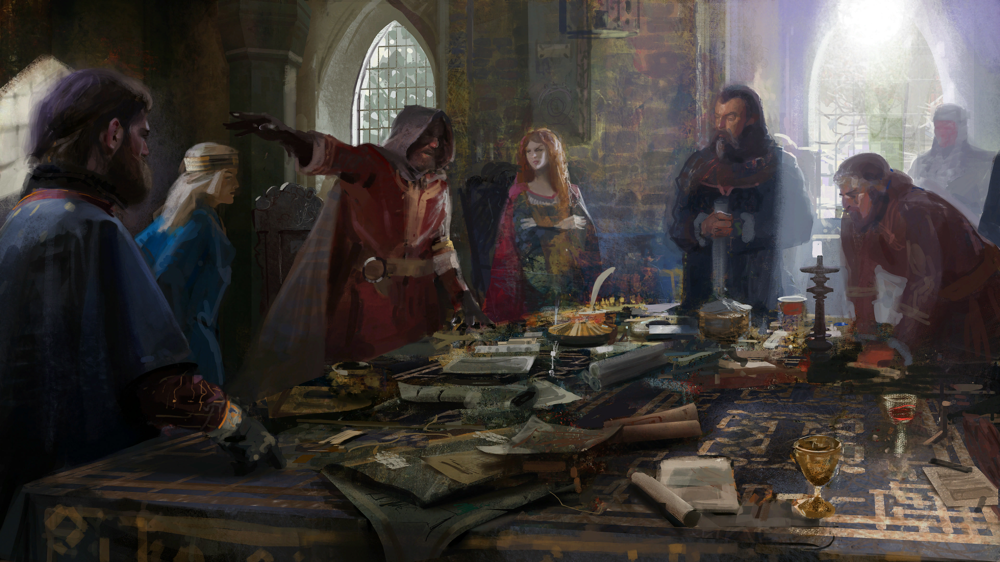</td>
    <td>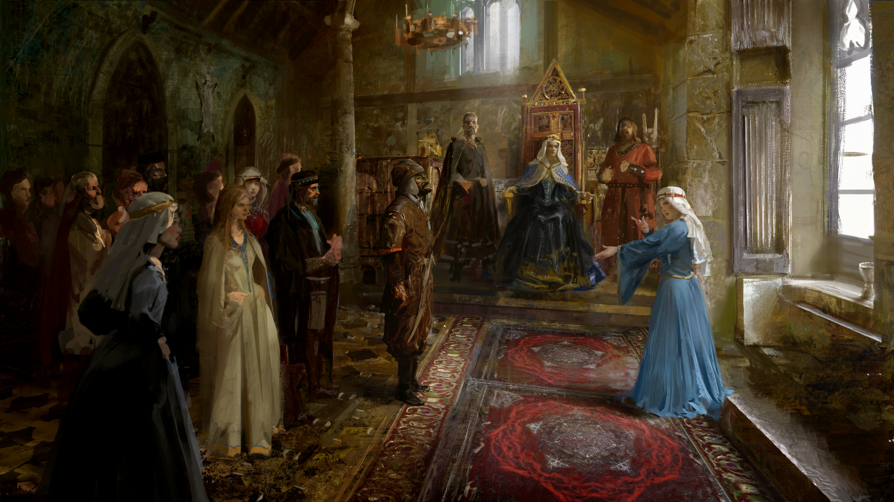</td>
  </tr>
  <tr>
    <td>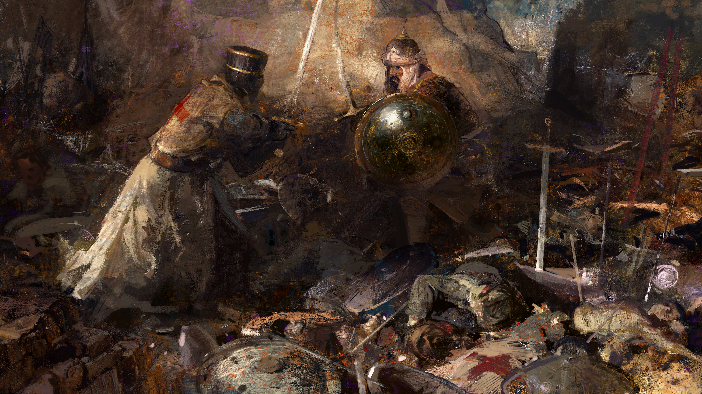</td>
    <td>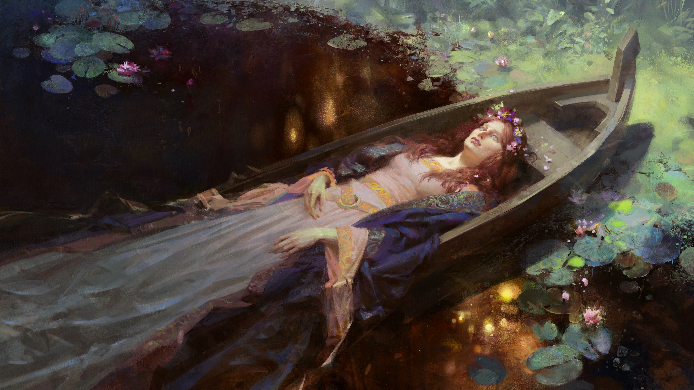</td>
    <td>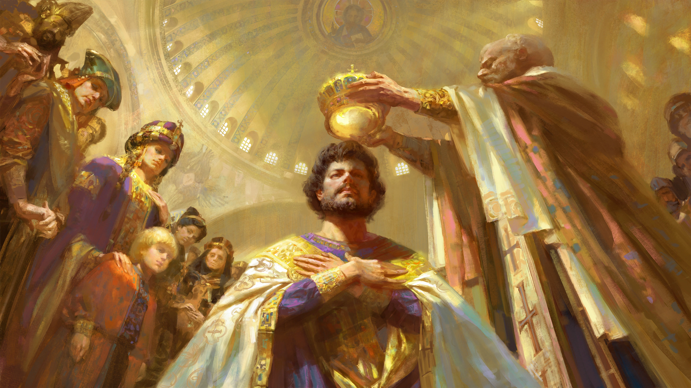</td>
  </tr>
  <tr>
    <td>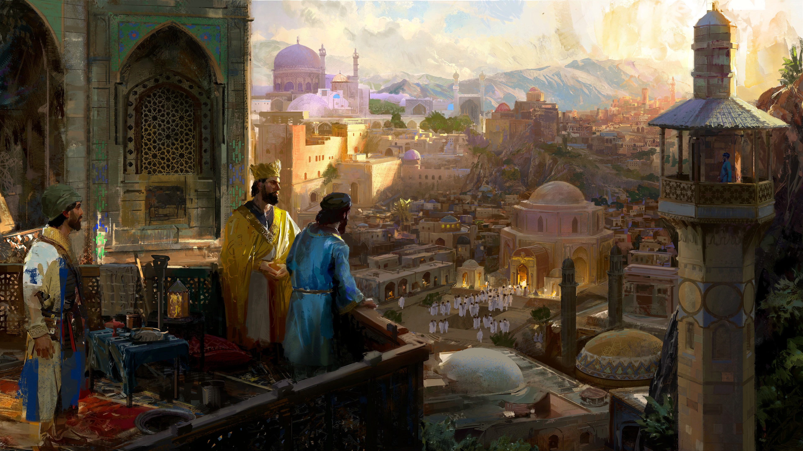</td>
    <td>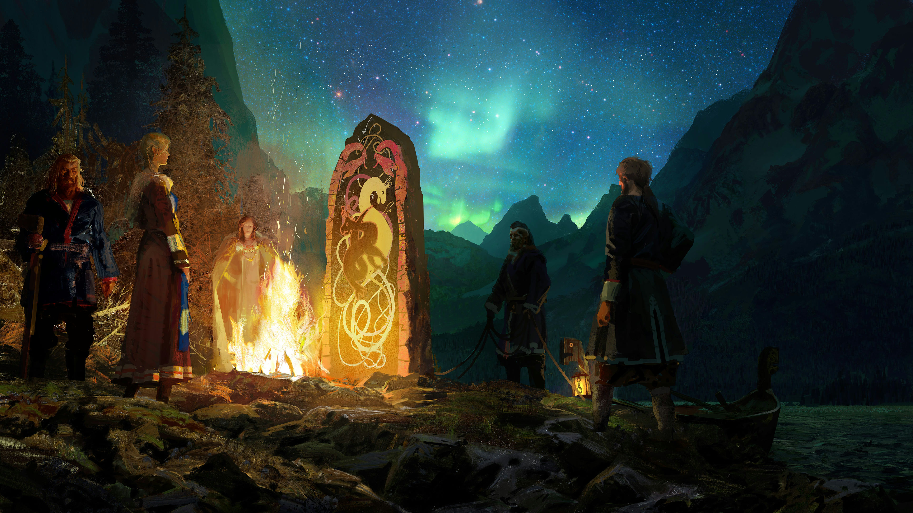</td>
    <td>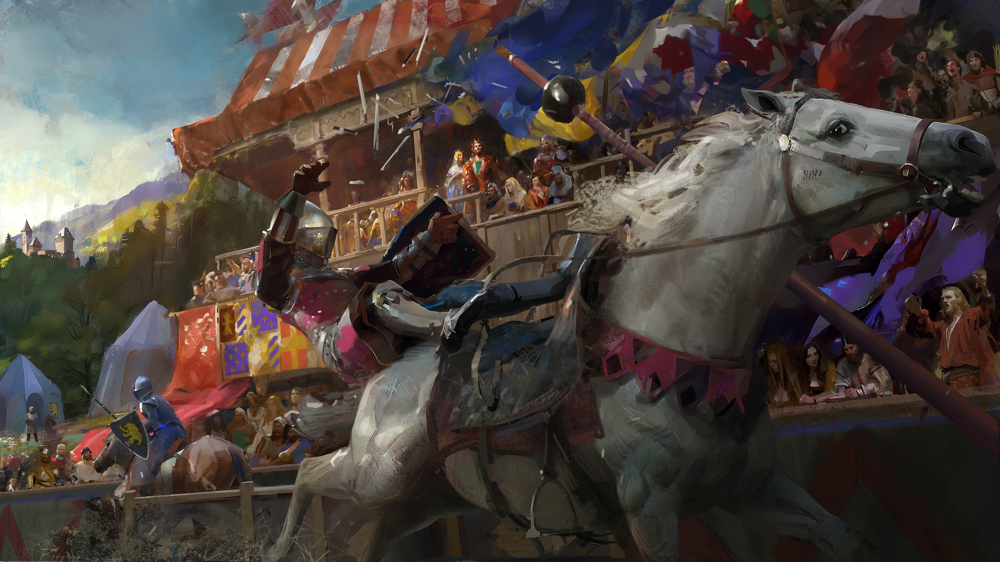</td>
  </tr>
</table>
